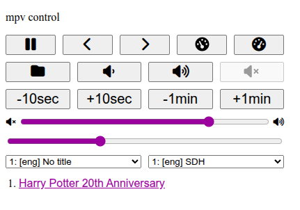

# remote_mpv.py - Control mpv using a web browser

This project allows you to control mpv running on the same or on a different machine using a web browser.

<p align="center">
    
</p>

`remote_mpv.py` is a web server that needs to be started on the same machine as mpv itself.
Once started, it can be accessed using any device on a local network to control mpv.

It's tested to work on Linux and Windows.

## Getting started

You need to start mpv with an option [`input-ipc-server`].
It's used for communication with mpv and is needed to be able to control it.
For example, on Linux start mpv as follows:

> On Windows, replace `/tmp/mpvsocket` with `\\.\pipe\mpvsocket`.

```
mpv --input-ipc-server=/tmp/mpvsocket <file>
```

The next step is to run `remote_mpv.py`.

Clone the repository or download a zip archive.

You probably have Python installed. If not, [install it](https://www.python.org/downloads/).

If your python executable is named `python3`, you can run the web server using the following command:

> The same path that you passed to [`input-ipc-server`] option, when started mpv, needs to be passed as `--ipc-path` to `remote_mpv.py`.
>
> If the path is not provided, the default one will be used. Run `python3 remote_mpv.py -h` to check the default.

```bash
python3 remote_mpv.py --ipc-path /tmp/mpvsocket
```

Now, the web server is running. The URL that you need to open in a browser to control mpv, will be printed to your terminal.
By default, it can be accessed only on localhost, i.e. on the same machine where it's started. To prevent accidental exposure in an untrusted network.

To listen on all interfaces, run the following command:

> Make sure to **run it only in trusted network**.

```bash
python3 remote_mpv.py --ipc-path /tmp/mpvsocket --address 0.0.0.0
```

## Watch a demo

<video src="https://github.com/user-attachments/assets/b73d90f8-b0b9-4b17-9062-fd5b6b11d90d"></video>

## Using in combination with umpv

You probably want to have a single mpv instance running at the same time.
Otherwise, multiple mpv instances will try to bind to the same socket, which will cause errors.
[`umpv`] allows you to do just that.

If you want to use `umpv` together with this project, you need to pass the same ipc path to `remote_mpv.py`, that used internally by `umpv`.

For example, on Linux you can use `umpv` as follows:

```
# Open a file using umpv and create .umpv socket in the current working directory
UMPV_SOCKET_DIR=$(pwd) umpv <file>

# Start server and pass the socket created above
python3 remote_mpv.py --ipc-path .umpv
```

To use `umpv` and `remote_mpv.py` on Windows, run the following commands:

```
python umpv <file>

# On Windows, you need to pass \\.\pipe\umpv
python remote_mpv.py --ipc-path \\.\pipe\umpv
```

## Comparison with simple-mpv-webui

In contrast to [_simple-mpv-webui_] the UI is usable on PC, not just on phone.
Additionally, you don't need to mess with luasocket, which is native dependency and may not be available depending on which mpv build you are using.

There are less features than in _simple-mpv-webui_ for sure.
I only added things that I find useful. [Watch a demo](#watch-a-demo) to see what is available.
If some feature is missing, keep using _simple-mpv-webui_ or send me PR to add it.

[`input-ipc-server`]: https://mpv.io/manual/stable/#options-input-ipc-server
[_simple-mpv-webui_]: https://github.com/open-dynaMIX/simple-mpv-webui
[`umpv`]: https://github.com/mpv-player/mpv/blob/master/TOOLS/umpv

## Using with curl

You can send JSON requests to the server started by `remote_mpv.py` using `curl`.
Which can be sometimes useful. See examples below.

To pause playback, run:

```bash
curl --json '{"pause": true}' http://127.0.0.1:7271/property
```

To get the current value of a property:

```bash
curl http://127.0.0.1:7271/property/pause
```

Switch to the second playlist entry:

```bash
curl --json '{"cmd": "playlist-play-index", "args": [1]}' http://127.0.0.1:7271/command
```

Increase current playback speed:

```bash
curl --json '{"cmd": "multiply", "args": ["speed", 1.1]}' http://127.0.0.1:7271/command
```

Seek forward 10 seconds:

```bash
curl --json '{"cmd": "seek", "args": [10]}' http://127.0.0.1:7271/command
```
