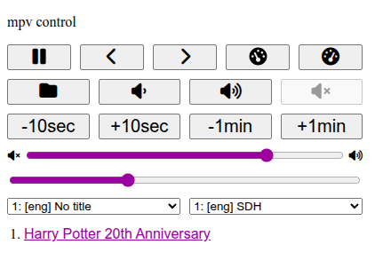
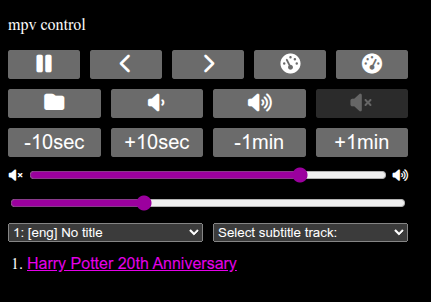

# Control mpv using a web browser

This project allows you to control mpv running on the same or on a different machine using a web browser.

## Screenshot

<p align="center">Light theme:</p>

<p align="center">
    
</p>

<p align="center">Dark theme:</p>

<p align="center">
    
</p>

`remote_mpv.py` is a web server that needs to be started on the same machine as mpv itself.
Once started, it can be accessed from any device on a local network to control mpv.

It has been tested on Linux and Windows.

## Getting started

You need to start mpv with the [`input-ipc-server`] option.
It is used for communication with mpv and is required to control it.
For example, on Linux, start mpv as follows:

> On Windows, replace `/tmp/mpvsocket` with `\\.\pipe\mpvsocket`.

```
mpv --input-ipc-server=/tmp/mpvsocket <file>
```

The next step is to run `remote_mpv.py`.

Clone the repository or download a zip archive.

You probably have Python installed. If not, [install it](https://www.python.org/downloads/).

If your python executable is named `python3`, you can run the web server using the following command:

> The same path that you passed to the [`input-ipc-server`] option when starting mpv must be passed to `remote_mpv.py` as `--ipc-path`.
>
> If the path is not provided, the default one will be used. Run `python3 remote_mpv.py -h` to check the default.

```bash
python3 remote_mpv.py --ipc-path /tmp/mpvsocket
```

The web server is now running. The URL that you need to open in a browser to control mpv will be printed to your terminal.
By default, it can only be accessed from localhost, that is the same machine on which it is running. This prevents accidental exposure on an untrusted network.

To listen on all interfaces, run the following command:

> Make sure to **run it only on a trusted network**.

```bash
python3 remote_mpv.py --ipc-path /tmp/mpvsocket --address 0.0.0.0
```

## Watch a demo

<video src="https://github.com/user-attachments/assets/b73d90f8-b0b9-4b17-9062-fd5b6b11d90d"></video>

## Using in combination with umpv

You probably want to have a single mpv instance running at the same time.
Otherwise, multiple mpv instances will try to bind to the same socket, which will cause errors.
[`umpv`] allows you to do exactly that.

If you want to use `umpv` together with this project, you need to pass the same IPC path to `remote_mpv.py` that used internally by `umpv`.

For example, on Linux you can use `umpv` as follows:

```
# Open a file using umpv and create .umpv socket in the current working directory
UMPV_SOCKET_DIR=$(pwd) umpv <file>

# Start server and pass the socket created above
python3 remote_mpv.py --ipc-path .umpv
```

To use `umpv` and `remote_mpv.py` on Windows, run the following commands:

```
python umpv <file>

# On Windows, you need to pass \\.\pipe\umpv
python remote_mpv.py --ipc-path \\.\pipe\umpv
```

## Using with SMPlayer

If you are using [SMPlayer] instead of mpv directly, you still can control
your media player using a browser.

You need to adjust the options that SMPlayer passes to mpv when starting it.
You need to add the [`input-ipc-server`] option, which will be used to send commands to mpv.

1. Open the SMPlayer _Preferences_ by pressing <kbd>Ctrl+P</kbd>. Go to _Advanced_ → _mpv_ and edit the _Options_ field by adding the `input-ipc-server` option:

   > Replace `<user>` with your username.

   ```
   --input-ipc-server=/home/<user>/mpvsocket
   ```
   
   

2. Make sure to open a video file for testing purposes.

3. You need to start `remote_mpv.py` by passing the same IPC path that you added to SMPlayer settings:

   > Run the command below only in a trusted network. The server will be accessible over LAN.

   ```
   python3 remote_mpv.py --ipc-path /home/<user>/mpvsocket --address 0.0.0.0
   ```

You can now open the link printed in your terminal to control SMPlayer from this device or another device on the same local network.

You can try to configure the other [GUI frontends] in a similar way.

[GUI frontends]: https://github.com/mpv-player/mpv/wiki/Applications-using-mpv#gui-frontends
[SMPlayer]: https://www.smplayer.info

## Comparison with simple-mpv-webui

In contrast to [_simple-mpv-webui_], the UI is usable on a PC, not just on a phone.
Additionally, you do not need to deal with LuaSocket, which is a native dependency and may not be available depending on the mpv build you are using.

There are fewer features than in _simple-mpv-webui_.
I only added things that I find useful. [Watch a demo](#watch-a-demo) to see what is available.
If a feature is missing, keep using _simple-mpv-webui_ or send me a PR to add it.

[`input-ipc-server`]: https://mpv.io/manual/stable/#options-input-ipc-server
[_simple-mpv-webui_]: https://github.com/open-dynaMIX/simple-mpv-webui
[`umpv`]: https://github.com/mpv-player/mpv/blob/master/TOOLS/umpv

## Using with curl

You can send JSON requests to the server started by `remote_mpv.py` using `curl`.
This can sometimes be useful. See examples below.

To pause playback, run:

```bash
curl --json '{"pause": true}' http://127.0.0.1:7271/property
```

To get the current value of a property:

```bash
curl http://127.0.0.1:7271/property/pause
```

Switch to the second playlist entry:

```bash
curl --json '{"cmd": "playlist-play-index", "args": [1]}' http://127.0.0.1:7271/command
```

Increase current playback speed:

```bash
curl --json '{"cmd": "multiply", "args": ["speed", 1.1]}' http://127.0.0.1:7271/command
```

Seek forward 10 seconds:

```bash
curl --json '{"cmd": "seek", "args": [10]}' http://127.0.0.1:7271/command
```
